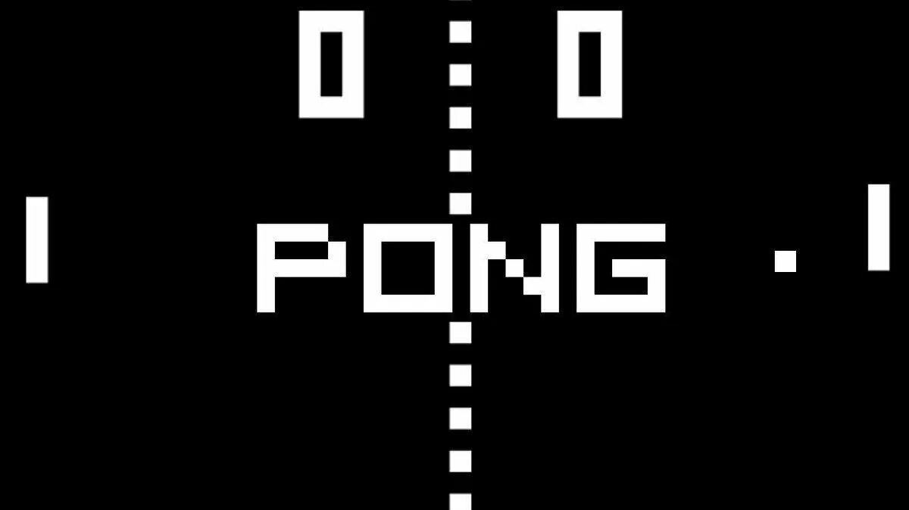

# Pong Game



## Overview

This repository contains a simple implementation of the classic Pong game in Python using the Turtle graphics library. The game features two paddles controlled by keyboard inputs, a bouncing ball, and a scoreboard to keep track of player scores.

## Features

- **Paddles**: Control the paddles using keyboard inputs (Player 1: Up and Down arrows, Player 2: W and S keys).
- **Ball**: The ball bounces off the walls and paddles, with its speed increasing after each paddle hit.
- **Scoreboard**: Keep track of player scores and display them at the top of the screen.

## Getting Started

### Prerequisites

- Python 3.x
- Turtle graphics library (usually included in Python standard library)

### Installation

1. Clone the repository:

   ```bash
   git clone https://github.com/RahmatillaMarvel/pong-game.git
   ```

2. Navigate to the project directory:

   ```bash
   cd pong-game
   ```

### Usage

1. Run the main script:

   ```bash
   python main.py
   ```

2. Use the keyboard inputs to control the paddles and try to prevent the ball from passing your paddle.

3. The game ends when you exit the game window.

## License

This project is licensed under the [MIT License](LICENSE).

## Acknowledgements

- The Pong game project was created by Rahmatilla Xudoyberdiyev.

